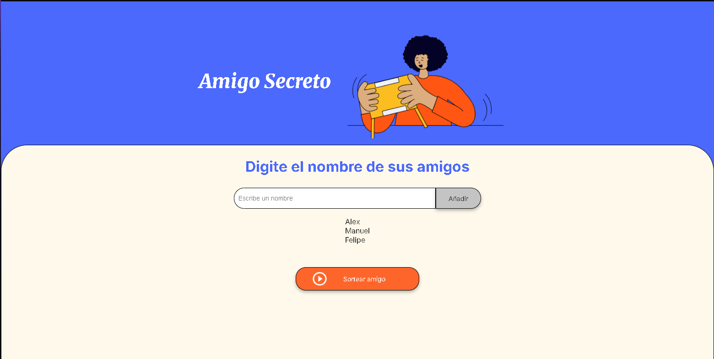

# Proyecto: Amigo Secreto - ALURA LATAM

## Descripción 
Este proyecto es una aplicación web sencilla que permite organizar un juego de "Amigo Secreto". Los usuarios pueden agregar nombres a una lista y posteriormente sortear aleatoriamente un nombre como el amigo secreto seleccionado.

## Vista previa 👀


## Funcionalidades 🛠️
- **Agregar amigos**: Introduce nombres y agrégalos a la lista.
- **Mostrar lista de amigos**: La lista se actualiza dinámicamente cada vez que se añade un nombre.
- **Sortear amigo secreto**: Selecciona aleatoriamente un nombre de la lista y lo muestra en la pantalla.
- **Limpiar lista tras el sorteo**: Una vez sorteado el amigo secreto, la lista se vacía automáticamente.

## Tecnologías usadas 💻
- **HTML**: Estructura de la página.
- **CSS**: Estilización básica.
- **JavaScript**: Lógica del proyecto.

## Archivos principales 📁
- `index.html`: Estructura visual del proyecto.
- `style.css`: Diseño de la página.
- `app.js`: Lógica de las funcionalidades.

## Instrucciones de uso 🚀
1. **Clonar el repositorio:**
   ```bash
   git clone <https://github.com/AlexTumbaco/Challenge-AmigoSecreto.git>
   ```

2. **Abrir el archivo `index.html`** en cualquier navegador.

3. **Agregar nombres** en el campo de texto y pulsar el botón "Añadir".

4. **Sortear amigo secreto** con el botón correspondiente.

5. **Disfrutar el resultado** y repetir si es necesario.
   
---
**¡Diviértete organizando tu amigo secreto! 🎉**

